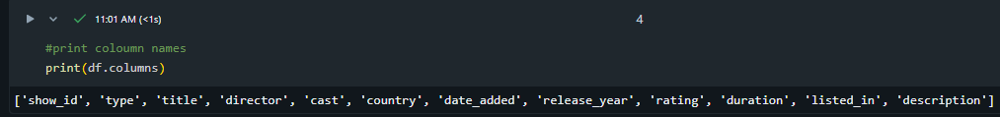
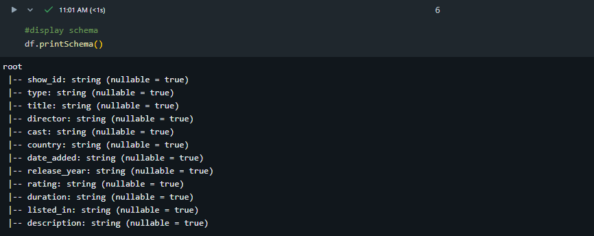
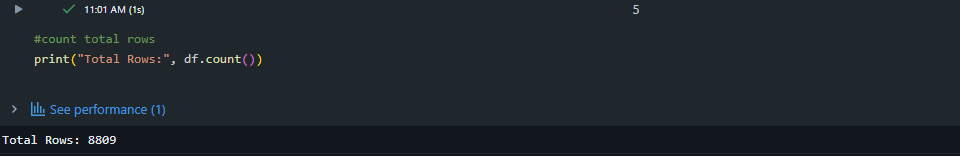
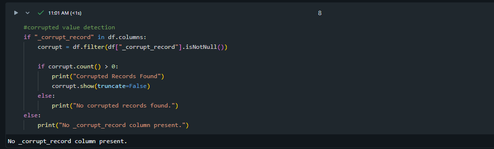
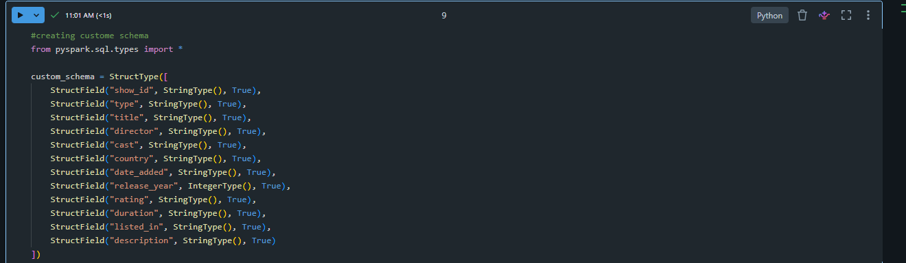
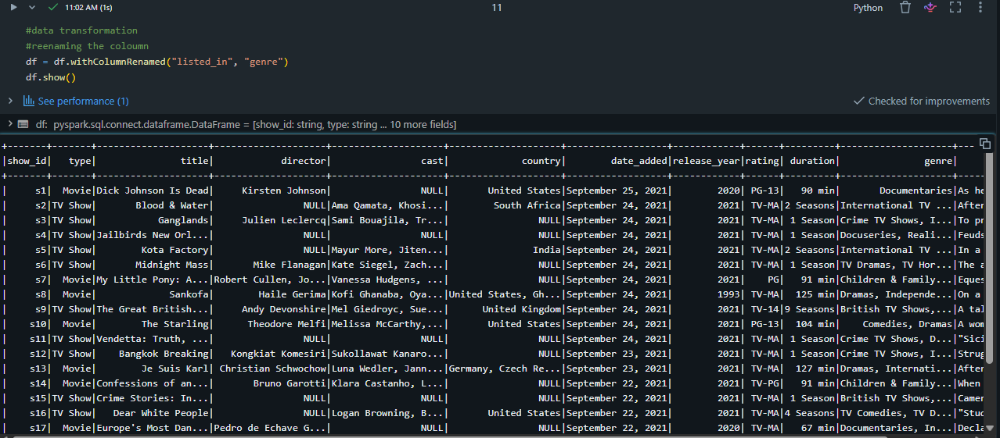
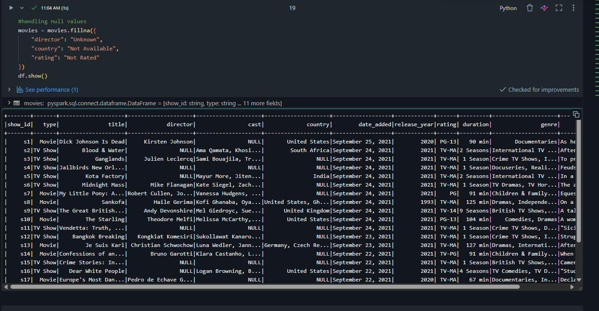
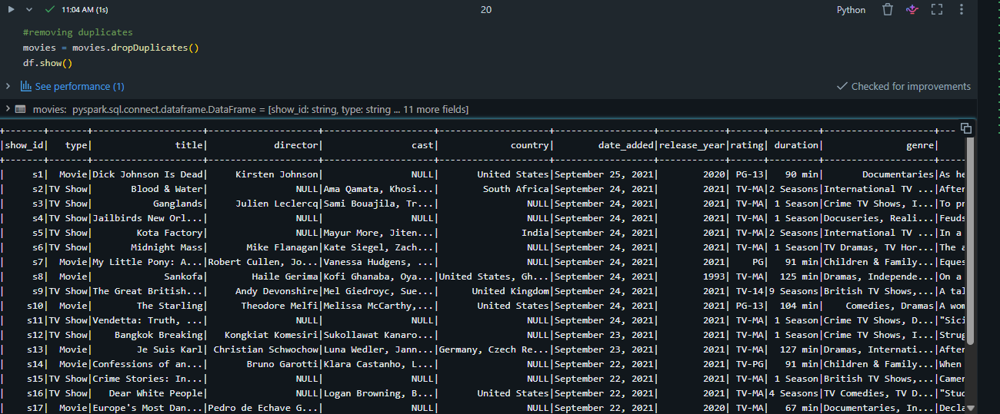
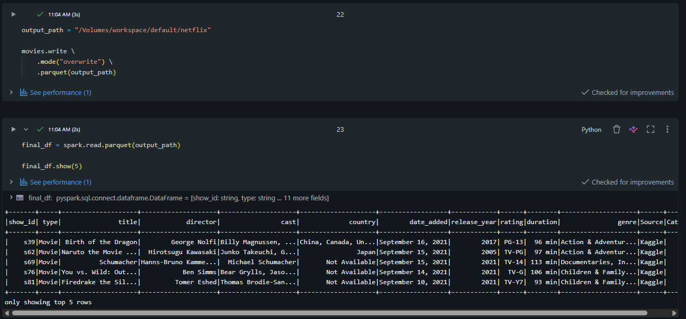

# PySpark Final Project – Milestone 2

## Student Information

- **Name:** Ashwith
- **Project:** Milestone 2 – Data Engineering using Apache Spark
- **Technology:** PySpark on Databricks

---

# Project Overview

This project demonstrates a complete data engineering workflow using Apache Spark (PySpark) on Databricks. The Netflix Movies and TV Shows dataset was downloaded from Kaggle, uploaded to Databricks, explored, validated, transformed, cleaned, and finally stored in Parquet format.

---

# Dataset Description

**Dataset Name:** Netflix Movies and TV Shows

**Source:** https://www.kaggle.com/datasets/shivamb/netflix-shows

### About the Dataset

This dataset contains information about movies and TV shows available on Netflix. It includes details such as:

- Show ID
- Type (Movie/TV Show)
- Title
- Director
- Cast
- Country
- Date Added
- Release Year
- Rating
- Duration
- Genre
- Description

The dataset was chosen because it contains different data types and missing values, making it suitable for practicing PySpark data engineering operations.

---

# Project Steps

## 1. Dataset Acquisition

Downloaded the Netflix Movies and TV Shows dataset from Kaggle.

---

## 2. Upload Dataset

Uploaded the CSV dataset into Databricks and accessed it from the workspace for processing.

---

## 3. Read Dataset

The dataset was loaded into a Spark DataFrame using:

- Header = True
- Infer Schema = True
- Read Mode = PERMISSIVE

This allowed Spark to load the data while handling malformed records safely.

---

## 4. Data Exploration

Performed the following exploratory operations:

- Printed all column names
- Counted the total number of rows
- Displayed the schema using `printSchema()`
- Counted the total number of columns

### Screenshot

📷 Insert Screenshot: Data Exploration

---

## 5. Corrupted Record Detection

Checked for corrupted records using PERMISSIVE mode.

No corrupted records were found in the dataset.

### Screenshot

📷 Insert Screenshot: Corrupted Record Check

---

## 6. Schema Validation

A custom schema was created using `StructType` and `StructField` to ensure each column had the correct data type before reading the dataset again.

### Screenshot

📷 Insert Screenshot: Custom Schema

---

## 7. Data Transformations

The following transformations were applied:

- Renamed columns using `withColumnRenamed()`
- Filtered only Movie records
- Used aliases for selected columns
- Added a constant column using `lit()`
- Added a new calculated column using `withColumn()`
- Converted data types using `cast()`
- Removed unnecessary columns using `drop()`

These transformations improved the quality and usability of the dataset.

### Screenshot

📷 Insert Screenshot: Transformations

---

## 8. Null Value Handling

Missing values were identified and handled using `fillna()`.

Examples:

- Director → Unknown
- Country → Not Available
- Rating → Not Rated

This ensured that important records were retained while reducing missing information.

### Screenshot

📷 Insert Screenshot: Null Values

---

## 9. Duplicate Removal

Duplicate records were removed using `dropDuplicates()` to improve data quality.

### Screenshot

📷 Insert Screenshot: Duplicate Removal

---

## 10. Write Processed Data

The cleaned dataset was written in **Parquet** format using **Overwrite** mode.

Parquet was selected because it offers:

- Faster query performance
- Better compression
- Reduced storage
- Efficient columnar storage

### Screenshot

📷 Insert Screenshot: Final Output

---

# Justification of Decisions

## Why PERMISSIVE Read Mode?

PERMISSIVE mode allows Spark to continue reading the dataset even if malformed records are encountered. Instead of failing, invalid records can be inspected separately, making it suitable for real-world datasets.

---

## Why Custom Schema?

A custom schema ensures that columns have the correct data types, avoids incorrect schema inference, and improves query performance.

---

## Why These Transformations?

The selected transformations helped to:

- Improve readability
- Clean the dataset
- Prepare the data for analysis
- Demonstrate commonly used PySpark DataFrame operations

---

## Why Handle Null Values?

Replacing null values preserved important records while improving the completeness and quality of the dataset.

---

## Why Parquet Format?

Parquet is an optimized columnar storage format that provides:

- Better compression
- Faster processing
- Lower storage requirements
- Improved performance for analytical queries

---

# Challenges Faced

### Challenge 1

Understanding Databricks file paths and uploading the dataset correctly.

**Solution**

Verified the upload location and used the correct file path while reading the CSV file.

---

### Challenge 2

Creating and applying a custom schema.

**Solution**

Used `StructType` and `StructField` to explicitly define the schema before loading the dataset.

---

### Challenge 3

Handling missing values appropriately.

**Solution**

Analyzed the dataset and replaced null values with meaningful default values using `fillna()`.

---

### Challenge 4

Applying multiple DataFrame transformations.

**Solution**

Used PySpark functions such as `filter()`, `withColumn()`, `cast()`, `drop()`, `alias()`, and `withColumnRenamed()` to transform the dataset step by step.

---

---

# Conclusion

This project successfully demonstrates an end-to-end ETL workflow using Apache Spark (PySpark) in Databricks. The dataset was explored, validated, cleaned, transformed, and stored in Parquet format while following standard data engineering practices.
